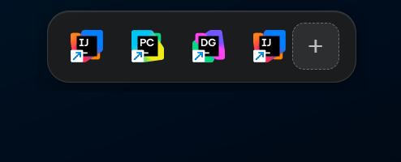

# Top Launcher (Hidden Panel)

A stylish hidden panel for Windows with an Acrylic/Glass design.

## Features
- Appears when you hover over it or press `Ctrl+Shift+Space`.
- Frosted glass (Acrylic) effect.

- Automatically extracts icons from programs.
- Quick launch of any .exe, .md, .lnk  files.

## How to Install
1. Go to the [Releases](https://github.com/Atoryx1s/AppPanell/releases/tag/v1.1.2).
2. Download the `AppPanell_1.1.2_x64_en-US.msi` or `AppPanell_1.1.2_x64-setup.exe` file.
3. Install and run it.
